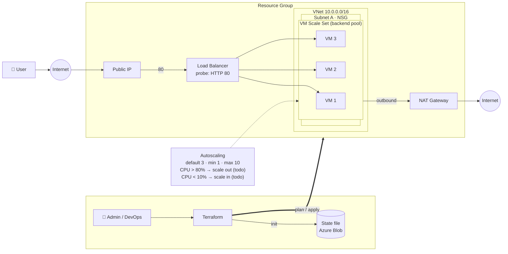

# Azure VMSS behind a Load Balancer (Terraform)

A web tier on Azure: a Virtual Machine Scale Set in a private subnet, served through a public Load Balancer, with outbound access via a NAT Gateway and Terraform state stored in Azure Blob Storage.

